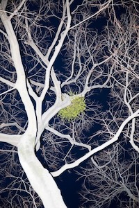
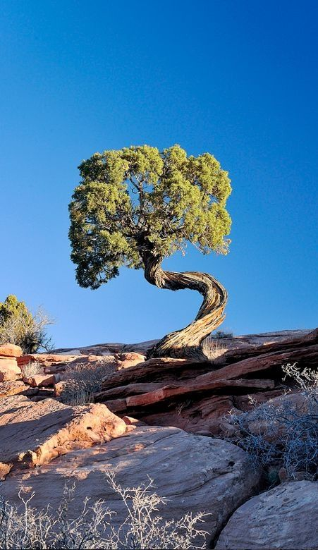
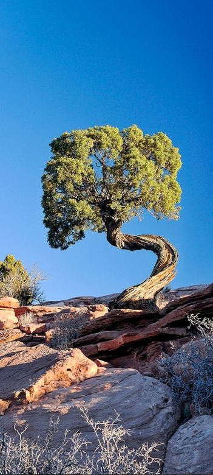

[Seam carving](https://doi.org/10.1145/1275808.1276390) is a content-aware image resizing algorithm, that is allows to resize images without neither cropping them nor stretching them. The algorithm works by calculating a seam of least important pixels in the image and removing it. This process is repeated until the desired width or height is reached. For example startig from this image:



The least important seam is calculated to be this one (in red):


This code lets you remove a desired amount of vertical seams from the image. To compile and run do:
```bash
gcc -o seam_carving main.c
./seam_carving image.png 400
```
Where `image.png` is the image you want to resize and `400` is the amount of vertical seams you want to remove. The output will be saved as `image_without400seams.png`.

Here are some examples:

Original | Reduced
--- | ---
 | 
 | 
 | 